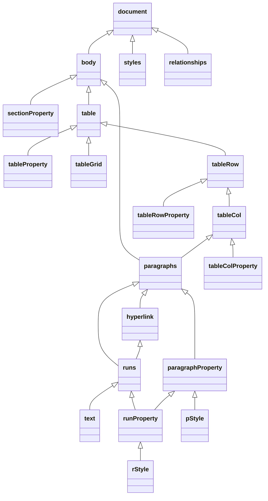

# Project1

## 前置知识

- C++
- Qt


## Markdown to HTML

[Markdown 基本语法 | Markdown 指南中文版](https://www.markdown.xyz/basic-syntax/)

试图语法简化：

- 不检测换行
- 列表中不允许添加另一种元素
- 块引用中可以包含其他元素


后来觉得基本语法中有很多没有well-defined的地方，遂采用[CommonMark Spec](https://spec.commonmark.org/)。

在虚拟机上研究一下其C的实现，似乎是PA级别的复杂度，但是一时半会儿看不懂……


可视化：[Markdown Tutorial](https://commonmark.org/help/tutorial/03-paragraphs.html)

语法实现：

- 标题：在一行的**起始**位置连用若干个`#`，`#`和文本之间有一个空格
- 代码：用额外的**至少四个空格宽**的缩进表示一个代码块，或使用**一对**```包裹一个代码块

> ``×3`后不可以加上代码类型

- 段落与换行：使用一个空行来开启新的段落，在一行的末尾使用**恰好**两个空格来换行，其处理具有惰性
- **引用**：前瞻为`>`和一个空格，可以内嵌标题、段落、**引用**，暂不允许内嵌代码，其处理具有**惰性**（基于段落的惰性）

> 别忘了内联引用，其处理与链接和图片类似

- 强调：只使用`*`，富文本包括标题、段落，不包括代码

> 这里并没有完全遵循[CommonMark Spec](https://spec.commonmark.org/)的语法，（个人的处理）`*`的个数**从三开始**，进行**最近**匹配
>

- 链接和图片：（个人的处理）在内部，链接的文本部分视为富文本；*在外部，链接或图片视为一个整体（未实现）*

> 使用正则表达式，惰性匹配
>

- 无序列表：

类似引用，但是行为有略微不同，当出现了前瞻字符时，列表总是试图创建一个新的段落，可以考虑下面的例子：

 ```
  - 123
  - 
  - 123
  
  > 123
  > 
  > 123
 ```

对于嵌套列表的惰性，则与引用类似：

```
- 123
- - 123
123
123
- - 123
```

- 有序列表：简化为仅以`1.`为前瞻字符
- HTML 标签：使用**QPlainTextEdit**似乎可以简单实现部分功能，但是外层有一对段落标签


### Laziness

引用（段落）的惰性：最后一行会被解析成三层引用，与[CommonMark Spec](https://spec.commonmark.org/)的语法不一致

```
> 123
> > 123
123
123
> > 123
```


### 中文编码

> 思考：中文编码后的特殊字符会不会干扰scan和parse？
>

加上`<meta charset="UTF-8">`


## Rendering and displaying HTML pages

[Qt WebEngine Widgets C++ Classes](https://doc.qt.io/qt-5/qtwebenginewidgets-module.html)

然而MinGW并不支持QtWebEngine，所以只能使用QAxWidget


## Submit

GitHub Classroom

会出现下列情形，目前尚不知其影响：

```
warning: LF will be replaced by CRLF in document_previewer/parser.h.
The file will have its original line endings in your working directory
```


## Release

首先以release方式编译生成.exe程序，然后使用D:\Qt\5.15.2\mingw81_64\bin\windeployqt进行Deployment。

然而.exe和.dll不在一个文件夹仍然无法运行。


# Project2


## Word

> Based on **Microsoft Word 2019**
>


### Open XML

[欢迎使用 Open XML SDK 2.5 for Office | Microsoft Docs](https://docs.microsoft.com/zh-cn/office/open-xml/open-xml-sdk)

最简单的 WordprocessingML 文档的主文档文章包括以下 XML 元素：

- document - WordprocessingML 的主文档部件的根元素，用于定义主文档文章。
- body - 包含主文章的块级别结构集合的容器。
- p - 一个段落。
- r - 一段连续文本。
- t - 一个文本范围。

[Word文件的OpenXML解析（以Python3为例）](https://blog.csdn.net/liuqixuan1994/article/details/104486600)

[Word OpenXML常用标签](https://blog.csdn.net/u010371710/article/details/51966236)


### 总体思路

1. 设计文档数据结构
2. 解析文档
3. 写入HTML

> CSS


一些可能的解决方案：

> [Handling Document Formats - Qt Wiki](https://wiki.qt.io/Handling_Document_Formats)
>
> [Handling Microsoft Word file format - Qt Wiki](https://wiki.qt.io/Handling_Microsoft_Word_file_format)

- 第三方库DuckX

[DuckX: C++ library for creating and updating Microsoft Word (.docx) files](https://github.com/amiremohamadi/DuckX)

只能实现简单的文字编辑，不支持格式

> [CMake 入门实战](https://www.hahack.com/codes/cmake/)

- 调用Python，Python使用第三方库

TODO

- Qt QAxWidget

[Microsoft.Office.Interop.Word](https://docs.microsoft.com/zh-cn/dotnet/api/microsoft.office.interop.word?view=word-pia)

目前只能逐行读取，且无法获取Style信息

> class WordEngine

- unzip the Open XML file and process the XML file directly

docx -> xml

> QXmlStreamReader: 线性
>
> QDomDocument: 树形	`qt += xml`

最终选择这个作为解决方案


### 预览

- 粗体、斜体、字体、字号、字体颜色、突出显示颜色（颜色需要注意不同的格式）

[RunProperties](https://docs.microsoft.com/zh-cn/dotnet/api/documentformat.openxml.wordprocessing.runproperties?view=openxml-2.8.1#properties)

[RunFonts](https://docs.microsoft.com/zh-cn/dotnet/api/documentformat.openxml.wordprocessing.runfonts?view=openxml-2.8.1)

- 段落对齐方式、段前后间距、行距（注意计算）、左右侧缩进、首行缩进（尚不知如何精确计算）

[ParagraphProperties](https://docs.microsoft.com/zh-cn/dotnet/api/documentformat.openxml.wordprocessing.paragraphproperties?view=openxml-2.8.1#properties)

> 添加功能，如rPr或pPr，修改几处地方：
>
> - ParagraphProperty或RunProperty的类定义和构造函数
> - domParagraphProperty或domRunProperty的解析
> - format
> - paragraphPropertyHierarchy或runPropertyHierarchy


- 页边距、页面大小

[SectionProperties](https://docs.microsoft.com/zh-cn/dotnet/api/documentformat.openxml.wordprocessing.sectionproperties?view=openxml-2.8.1#properties)

- 样式（default、h1-6、title、subtitle）

[ParagraphStyleId](https://docs.microsoft.com/zh-cn/dotnet/api/documentformat.openxml.wordprocessing.paragraphstyleid?view=openxml-2.8.1)

> 若得到的样式不在styleIDSet中，可考虑assert(0)处理
>
> 或者动态变化styleIDSet（先解析document，后解析style）


> style hierarchy:
>
> - Document defaults
> - Table styles
> - Numbering styles
> - Paragraph styles
> - Character styles
> - Direct Formatting


#### XML 结构



> 暂不考虑:
>
> - `paragraphProperty <|-- runProperty`
> - `runProperty <|-- rStyle`


#### 更多功能

- 超链接

一种编码为：

```
<w:p w:rsidP="00166FC2" w:rsidRDefault="00530648" w:rsidRPr="00166FC2" w:rsidR="00B13A56" w14:textId="1D9791CA" w14:paraId="773E792D">
    <w:r>
    	<w:fldChar w:fldCharType="begin"/>
    </w:r>
    <w:r>
    	<w:instrText xml:space="preserve"> HYPERLINK "https://cn.bing.com/" </w:instrText>
    </w:r>
    <w:r>
    	<w:fldChar w:fldCharType="separate"/>
    </w:r>
    <w:r w:rsidRPr="00166FC2" w:rsidR="00EE3A1D">
        <w:rPr>
        	<w:rStyle w:val="ad"/>
        </w:rPr>
        <w:t>必应</w:t>
    </w:r>
    <w:r>
        <w:rPr>
        	<w:rStyle w:val="ad"/>
        </w:rPr>
        <w:fldChar w:fldCharType="end"/>
    </w:r>
</w:p>
```

另一种编码为：

```
<w:p w:rsidP="00166FC2" w:rsidRDefault="00902AE8" w:rsidRPr="00166FC2" w:rsidR="00B13A56" w14:textId="30777BC3" w14:paraId="773E792D">
    <w:bookmarkStart w:name="_GoBack" w:id="0"/>
    <w:bookmarkEnd w:id="0"/>
    <w:r>
        <w:rPr>
            <w:rFonts w:hint="eastAsia"/>
        </w:rPr>
        <w:t>必应</w:t>
    </w:r>
    <w:hyperlink r:id="rId7" w:history="1">
        <w:r w:rsidRPr="00166FC2" w:rsidR="00EE3A1D">
            <w:rPr>
                <w:rStyle w:val="ad"/>
            </w:rPr>
            <w:t>必应</w:t>
        </w:r>
    </w:hyperlink>
    <w:r>
        <w:rPr>
            <w:rFonts w:hint="eastAsia"/>
        </w:rPr>
        <w:t>必应</w:t>
    </w:r>
</w:p>
```

目前只考虑第二种编码。

处理思路为：

1. 不考虑`rStyle`
2. 在`domParagraphInfo`中对`w:hyperlink`进行特判，记录ID，并在其所有的runs结点的`rPr`中添加ID信息（多个runs会导致vis后的颜色变化不统一，因而设置颜色不变）
3. 得到ID到超链接的映射表，在解析时使用


- 图片

`w:drawing`

有点难，放弃了。


- 表格

[Table](https://docs.microsoft.com/zh-cn/dotnet/api/documentformat.openxml.wordprocessing.table?view=openxml-2.8.1)

为简单起见，只保留属性`td width`和`tr height`，其余均为预设：

```
<style>
	table, table tr th, table tr td { border: 1px solid #000000; }
	table { border-collapse: collapse; }
</style>
```

利用C++17中的[std::variant](https://zh.cppreference.com/w/cpp/utility/variant)修改数据结构：

```
vector<variant<shared_ptr<ParagraphInfo>, shared_ptr<Table>>>
```


#### 参考实现

[Document.SaveAs2 方法 (Word) | Microsoft Docs](https://docs.microsoft.com/zh-cn/office/vba/api/word.saveas2)


#### TODO

- [x] 测试：空行；整合测试文档
- [ ] 编辑功能：目前只能使用已有格式，而不能修改格式，待Project3处理

> example: textedit
>
> 或者研究一下QTextDocument类


### 解压

[stachenov/quazip](https://github.com/stachenov/quazip)


## Latex


### 语法入门

[一份其实很短的 LaTeX 入门文档](https://liam.page/2014/09/08/latex-introduction/)


### 总体思路

使用[pandoc](https://pandoc.org/)将Latex转换为~~Word~~或HTML。

> Qt -> QProcess


### 前端参考

[Amshaegar/PandoQ: Qt GUI frontend for Pandoc](https://github.com/Amshaegar/PandoQ)


### TODO

- [x] 调用pandoc时的异常处理（根据对应文件是否生成来判断，也许有点不妥）
- [x] 样式主题
- [x] 导言区中定义的标题、作者、日期
- [x] 图片链接后缀名（源文件中显式加上，就不需要Fix了）
- [ ] 目录
- [ ] 编辑功能：使用自定义**QDialog**，待Project3处理


### 样式主题

textedit默认生成的HTML如下：

```
<style type=\"text/css\">\np, li { white-space: pre-wrap; }\n</style>
```

由于在**编辑**阶段，textedit无法显示样式的变化，于是决定在**预览**阶段显示。

使用自定义**QDialog**（QWidget和MainWindow似乎很难进行**阻塞**）选择主题。

> 从Typora主题文件夹里面~~偷~~了几个过来
>
> 使用Qt Resource System保存css文件

目前只支持Latex，可以考虑Markdown适配，然而Word显然不能。


# Project3


实际上`QFileDialog`类已经实现了大部分功能……

还是自己写一个吧……


## 基本要求

- 使用`QTreeWidget`类展示搜索界面
- 通过`QDir`类的`entryList`方法过滤文件


## 功能扩展

- 修改日期、大小
- 处理逻辑优化
- UI 界面美化

